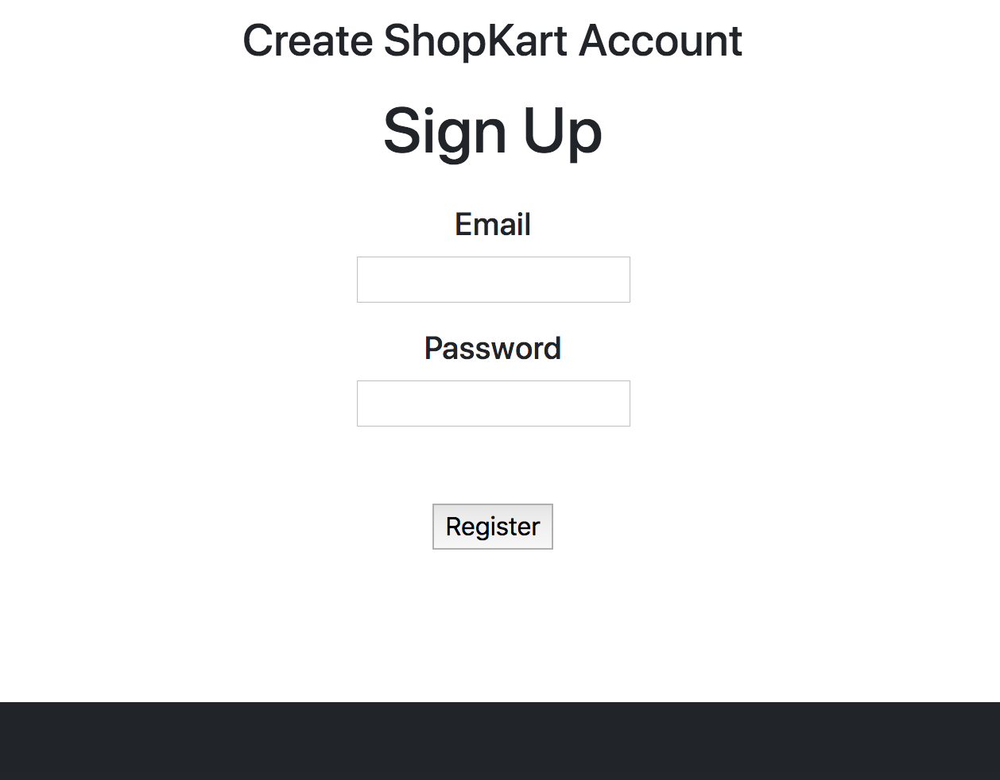
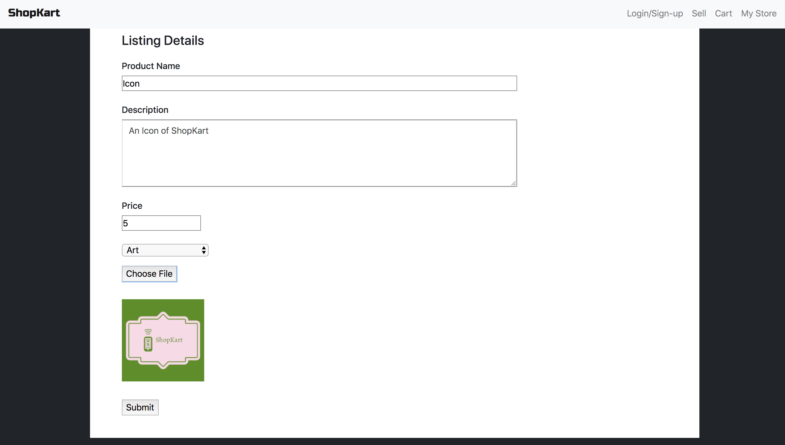
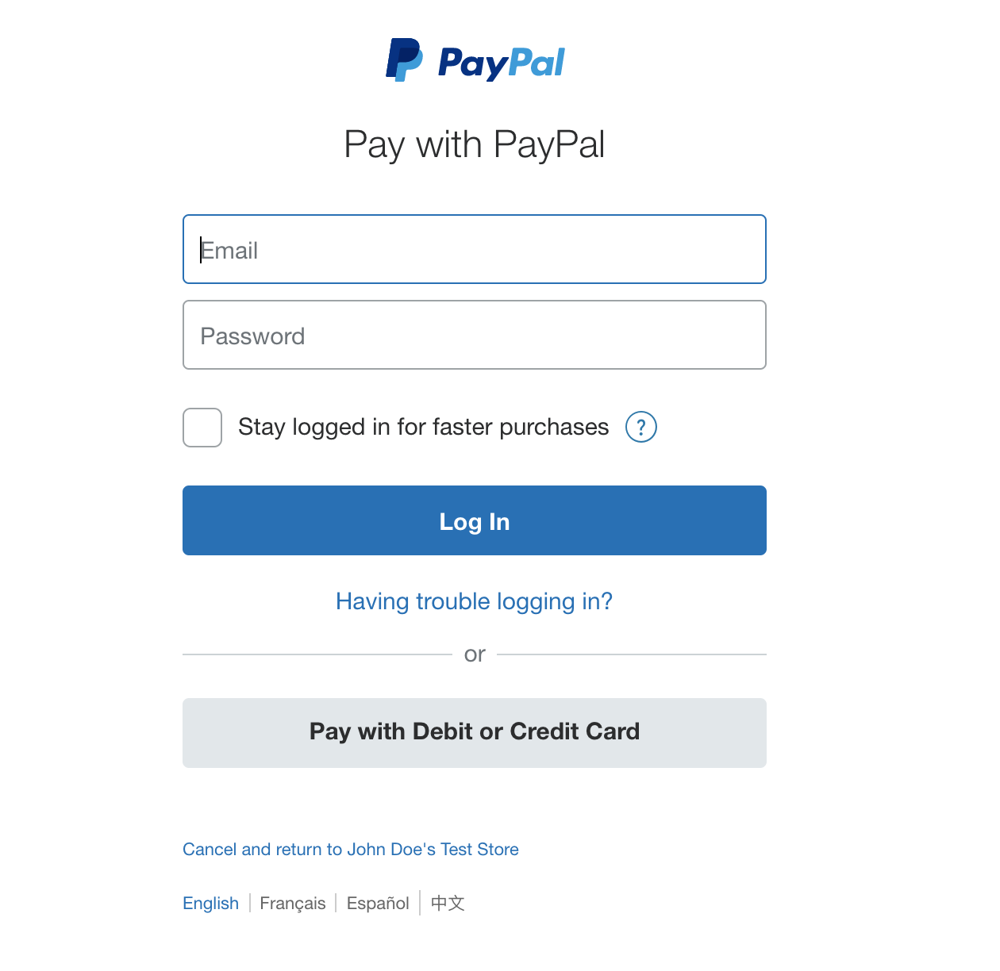

# ShopKart
Create your own store, where you can sell the items you like to others. Customers can also buy items they see fit, with the use of paypal as the main money transaction application.

## Team Members
1. Ismael Lopez
2. Wei Jiang
3. Pavel Zapolski

## Technologies
Node.js, Javascript, Express, MySQL, HTLML, CSS

## Create Account
Users will be able to create their own unqiue account. 

## Create Listing
Create your own listing by filling out the product name, description of your product, the price you want to sell it at, and a picture of your product.

# Purchase
All transaction will be protected through paypal incase of items not being as described by sellers or buyers returning the incorrect items.

